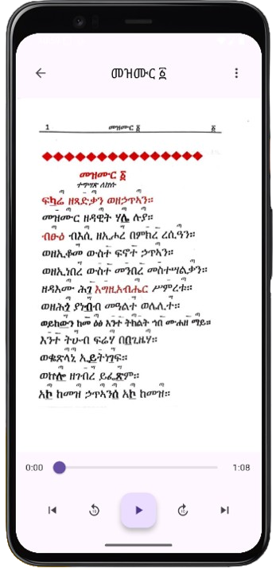

# መዝሙር ዳዊት (Mezmur Dawit App)

መዝሙር ዳዊት የሞባይል መተግበሪያ በFlutter የተሰራ ነው።

## መሰረታዊ ተግባራት

### 1. የመዝሙር ማውጫ
- ሁሉንም መዝሙሮች በዝርዝር ማየት
- መዝሙሮችን በቁጥር፣ በስም እና በይዘት መፈለግ
- መዝሙሮችን በካቴጎሪ መለየት (ለምሳሌ፦ የቅዳሴ፣ የፍሬቃና፣ የሌሊት ውዳሴ)

### 2. የመዝሙር ዝርዝር ማሳያ
- የመዝሙሩን ሙሉ ጽሑፍ ማየት
- የመዝሙሩን ትርጉም ማየት (ከተገኘ)
- የመዝሙሩን ድምጽ ማዳመጥ

### 3. ተጨማሪ ገጽታዎች
- ተወዳጅ መዝሙሮችን ማስቀመጥ
- የመዝሙር ጽሑፍን መጋራት
- የመተግበሪያው ቋንቋ መምረጥ (አማርኛ/እንግሊዝኛ)
- የመዝሙር መጽሐፍ ከበይነመረብ ውጭ መጠቀም

## ቴመተግበሪያው እይታዎች

### መግቢያ ገጽ

- የመዝሙሮች ዝርዝር
- የፍለጋ ሳጥን
- የካቴጎሪ ማውጫ

### የመዝሙር ዝርዝር ገጽ

- የመዝሙሮች ዝርዝር ማሳያ
- ፈጣን ፍለጋ
- በካቴጎሪ ማጣሪያ

### የመዝሙር ዝርዝር ማሳያ ገጽ

- የመዝሙር ሙሉ ጽሑፍ
- የድምጽ ማጫወቻ
- መጋሪያ አማራጭ
- ወደ ተወዳጆች መጨመሪያ

### ቅንብሮች ገጽ

- የቋንቋ ምርጫ
- የጽሑፍ መጠን ማስተካከያ
- የጨለማ ሁነታ ማብሪያ/ማጥፊያ
- የበይነመረብ ውጭ አጠቃቀም ቅንብሮች

---
መተግበሪያው ቀላል እና ለመጠቀም ምቹ በሆነ መልኩ የተዘጋጀ ሲሆን፣ ሁሉም  ሰው በቀላሉ ሊጠቀምበት የሚችል ነው።
